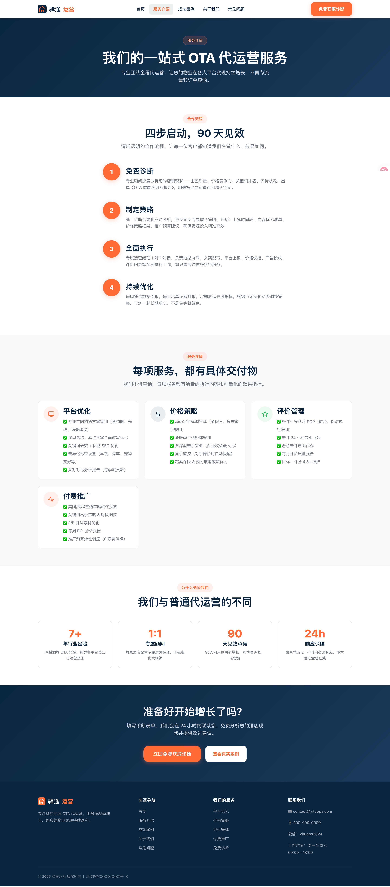

<div align="center">

# 示例：驿途运营

**专业酒店民宿代运营官网**

[](https://nodejs.org/)
[](https://vitejs.dev/)
[](LICENSE)

[在线预览](#页面预览) · [快速开始](#快速开始) · [部署指南](#部署) · [配置清单](#上线前配置清单)

</div>

---

## 概述

该项目是面向酒店民宿代运营服务的网站，旨在通过真实数据、专业内容和清晰的服务说明建立信任，驱动客户提交诊断咨询。

纯静态实现，零后端依赖，可部署至任意静态托管平台。

本项目全程基于自然语言进行 Vibe Coding，用的Bolt Free额度。

## 页面预览

| 首页 | 服务介绍 |
|:---:|:---:|
|  |  |

| 成功案例 | 关于我们 |
|:---:|:---:|
|  |  |

## 特性

- **纯静态** — HTML5 + CSS3 + 原生 JS，无框架依赖，零后端
- **移动端优先** — 三断点自适应（手机 / 平板 / 桌面），底部 TabBar + 汉堡菜单
- **数字滚动动画** — 统计数据从 0 滚动至目标值，Intersection Observer 触发
- **案例筛选与弹窗** — 按类别实时筛选，点击卡片弹出详情含 Chart.js 折线图
- **表单无后端提交** — 前端验证 + Formspree 异步 POST，成功内联感谢提示
- **组件动态加载** — 头部/页脚异步 fetch，统一维护
- **访问统计** — 不蒜子计数器集成
- **SEO 基础** — 每页独立 title / description / canonical，sitemap.xml

## 技术栈

| 类别 | 技术 |
|:-----|:-----|
| 结构 | HTML5（语义化） |
| 样式 | CSS3（自定义属性 + Flexbox + Grid + `clamp()` 响应式字体） |
| 交互 | 原生 JavaScript ES6+ |
| 图表 | [Chart.js](https://www.chartjs.org/) 4.x（CDN，仅案例详情页） |
| 统计 | [不蒜子](https://busuanzi.ibruce.info/) 2.3（CDN，页脚） |
| 表单 | [Formspree](https://formspree.io/)（无后端提交） |
| 构建 | [Vite](https://vitejs.dev/) 8 |

## 目录结构

```
.
├── index.html              # 首页
├── services.html           # 服务介绍
├── cases.html              # 成功案例
├── about.html              # 关于我们
├── contact.html            # 联系 / 免费诊断表单
├── faq.html                # 常见问题
├── 404.html                # 自定义 404
├── sitemap.xml             # SEO 站点地图
│
├── components/
│   ├── header.html         # 全局头部（导航 + 汉堡菜单 + TabBar）
│   └── footer.html         # 全局页脚（链接 + 联系 + ICP + 不蒜子）
│
├── assets/
│   ├── css/
│   │   └── style.css       # 完整样式
│   ├── js/
│   │   ├── main.js         # 全局逻辑（导航 / 动画 / 弹窗 / 手风琴）
│   │   ├── cases.js        # 案例数据 + 渲染 + 筛选
│   │   └── contact.js      # 表单验证 + Formspree 提交 + 微信复制
│   └── images/
│       └── logo.svg        # 品牌 Logo
│
├── public/                 # Vite 公共资源
├── src/                    # Vite React 入口（构建系统保留）
├── package.json
├── vite.config.ts
├── tsconfig.json
└── .gitignore
```

## 页面说明

### 首页 `index.html`

Hero 标语 + 4 项统计动画 + 4 张服务卡片 + 3 个精选案例 + 3 条客户证言 + OTA 平台品牌墙 + CTA 行动号召。

### 服务介绍 `services.html`

4 步时间轴流程（诊断 → 策略 → 执行 → 优化）+ 4 项服务各列 5 条交付物 + 4 张差异化数据卡片。

### 成功案例 `cases.html`

筛选按钮（全部 / 民宿 / 精品酒店 / 连锁酒店）+ 6 个案例卡片 + 模态弹窗（前后对比 + Chart.js 折线图）。

数据定义在 `assets/js/cases.js` 的 `cases` 数组中，新增案例只需追加对象。

### 关于我们 `about.html`

品牌故事（左文右图）+ 4 人核心团队 + 3 项服务理念 + OTA 平台品牌墙。

### 联系诊断 `contact.html`

5 字段表单（姓名 / 手机号 / 酒店名 / 平台 / 需求描述）+ 前端验证 + Formspree 提交 + 微信号复制按钮。

| 字段 | 类型 | 验证 |
|:-----|:-----|:-----|
| 姓名 | text | ≥ 2 字 |
| 手机号 | tel | `1[3-9]` 开头 11 位 |
| 酒店/民宿名称 | text | ≥ 2 字 |
| 主做平台 | select | 必选 |
| 需求简述 | textarea | ≥ 10 字 |

### 常见问题 `faq.html`

9 个手风琴 FAQ，分三类：收费与合同（3）、数据与安全（2）、配合与执行（4）。

### 自定义 404 `404.html`

描边大号 404 + 友好提示 + 返回首页/免费诊断按钮。

## 设计规范

### 色彩

| 用途 | 色值 | 预览 |
|:-----|:-----|:-----|
| 主色 | `#0A2540` |  |
| 强调 / CTA | `#FF6B35` |  |
| 背景 | `#F8F9FA` |  |
| 卡片 | `#FFFFFF` |  |
| 成功 / 增长 | `#22C55E` |  |
| 危险 / 下降 | `#EF4444` |  |

### 响应式断点

| 断点 | 宽度 | 特征 |
|:-----|:-----|:-----|
| 手机 | < 768 px | 单列 / 汉堡菜单 / 底部 TabBar |
| 平板 | 768 – 1023 px | 双列 / 隐藏 Hero 图 |
| 桌面 | ≥ 1024 px | 3–4 列 / 水平导航 |

### 交互

- 卡片悬停：上移 4px + 阴影增强
- 按钮 focus-visible：3px 橙色描边
- 移动端点击目标：≥ 44 × 44 px
- 全局平滑滚动

## 快速开始

### 前置条件

- [Node.js](https://nodejs.org/) 18+
- npm 9+

### 安装

```bash
git clone https://github.com/ligyDt/vibe-ota-hotel-website-v1.git
cd vibe-ota-hotel-website-v1
npm install
```

### 运行

```bash
npm run dev
```

浏览器访问 **http://localhost:5173/**

> 静态 HTML 页面由 Vite 开发服务器直接提供，无需额外配置。

### 命令

| 命令 | 说明 |
|:-----|:-----|
| `npm run dev` | 启动开发服务器（热重载） |
| `npm run build` | 生产构建，输出至 `dist/` |
| `npm run preview` | 预览生产构建 |
| `npm run lint` | ESLint 检查 |

### 端口修改

编辑 `vite.config.ts`：

```ts
export default defineConfig({
  plugins: [react()],
  server: {
    port: 3000,      // 改为所需端口
    host: '0.0.0.0', // 允许局域网访问
  },
})
```

或临时指定：`npm run dev -- --port 3000`

## 上线前配置清单

> 以下为上线前 **必须** 修改的占位符。

### 1. Formspree 表单 ID

编辑 `assets/js/contact.js`：

```js
const FORMSPREE_ID = 'xdkgbyqn';  // → 替换为您的 Form ID
```

获取：注册 [formspree.io](https://formspree.io/)，创建表单后获得 ID。

### 2. ICP 备案号

编辑 `components/footer.html`：

```html
<a href="https://beian.miit.gov.cn/">京ICP备XXXXXXXXX号-X</a>  <!-- → 替换 -->
```

### 3. 联系信息

更新 `components/footer.html` 和 `contact.html` 中的：
- 邮箱地址
- 电话号码
- 微信号（`contact.html` 中 `data-wechat` 属性）

### 4. 图片素材

当前使用 Unsplash 占位图，需替换为真实素材：
- 团队照片（`about.html`）
- 酒店案例照片（`cases.js` 中的 `img` 字段）
- Hero 大图（`index.html`）

### 5. 域名

`sitemap.xml` 和各页 `<link rel="canonical">` 中的域名需替换：

```
https://yituops.com/ → 您的实际域名
```

## 部署

```bash
npm run build
# dist/ 即为可部署产物
```

| 平台 | 方式 |
|:-----|:-----|
| [Vercel](https://vercel.com/) / [Netlify](https://www.netlify.com/) | 关联 Git 仓库，自动构建 |
| [GitHub Pages](https://pages.github.com/) | 推送 `dist/` 至 `gh-pages` 分支 |
| 阿里云 OSS / 腾讯云 COS | 上传 `dist/` 目录 |
| Nginx / Apache | `dist/` 作为网站根目录 |

> `components/` 和 `assets/` 需与 HTML 文件保持相对路径关系。

## 案例数据维护

案例定义在 `assets/js/cases.js` 的 `cases` 数组中：

```js
{
  id: 1,                              // 唯一 ID
  name: '西湖悦居民宿',                // 酒店名称
  category: '民宿',                    // 类别（民宿 / 精品酒店 / 连锁酒店）
  platform: '美团 · 携程',             // 主做平台
  location: '杭州西湖',                // 位置
  img: 'https://...',                 // 图片 URL
  desc: '...',                         // 详细描述
  before: { occ: '42%', revenue: '¥ 28,000' },
  after:  { occ: '78%', revenue: '¥ 68,000' },
  metrics: [
    { label: '入住率提升', after: '36%', up: true },
  ],
  chartData: {
    labels: ['1月', '2月', '3月', '4月', '5月', '6月'],
    values: [42, 48, 55, 63, 71, 78],
  }
}
```

追加对象即可自动渲染新案例。

## 无障碍 & SEO

<details>
<summary>无障碍</summary>

- 按钮/链接 `:focus-visible` 橙色描边
- 汉堡菜单 `aria-expanded` + `aria-controls`
- 弹窗 `role="dialog"` + `aria-modal="true"`
- 表单 `type` / `autocomplete` / `aria-required`
- 图片语义化 `alt`
- 移动端点击目标 ≥ 44 × 44 px

</details>

<details>
<summary>SEO</summary>

- 每页独立 `<title>` + `<meta name="description">`
- 每页 `<link rel="canonical">`
- 语义化标签（`<header>` / `<main>` / `<section>` / `<article>` / `<footer>`）
- `sitemap.xml` 涵盖全部页面

</details>

## 常见问题

<details>
<summary>本地开发时页面空白？</summary>

确保通过 `npm run dev` 启动 Vite 开发服务器，不要直接用 `file://` 协议打开 HTML 文件——组件加载依赖 fetch API，需要 HTTP 服务器。

</details>

<details>
<summary>不蒜子统计不显示？</summary>

不蒜子脚本加载可能因网络原因失败，统计区域默认隐藏（`display:none`），脚本成功加载后自动显示。不影响页面正常使用。

</details>

<details>
<summary>如何修改主色调？</summary>

编辑 `assets/css/style.css` 顶部的 CSS 自定义属性：

```css
:root {
  --color-primary: #0A2540;    /* 主色 */
  --color-accent: #FF6B35;     /* 强调色 */
}
```

</details>

## 贡献

1. Fork 本仓库
2. 新建分支：`git checkout -b feature/your-feature`
3. 提交修改：`git commit -m "Add your feature"`
4. 推送分支：`git push origin feature/your-feature`
5. 提交 Pull Request

## 许可证

[MIT](LICENSE) © ligyDt
